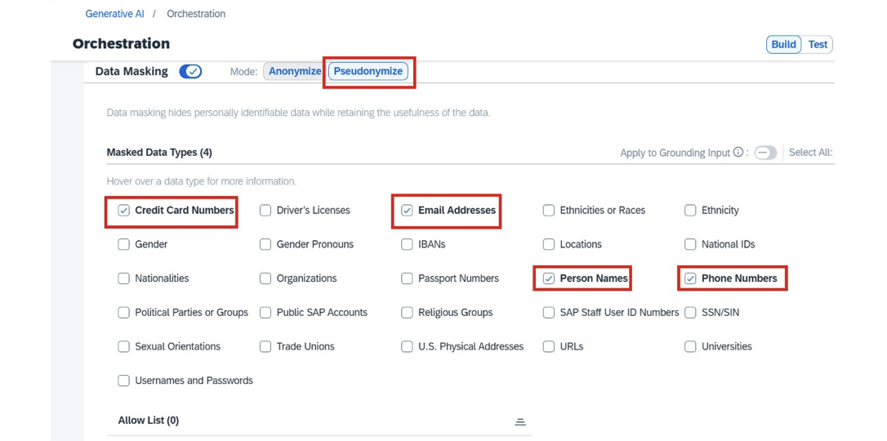
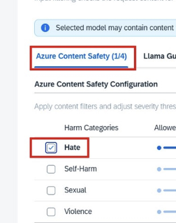

SAP Certified - SAP Generative AI Developer

<!-- TOC -->

- [Discovering SAP Business AI](#discovering-sap-business-ai)
- [Navigating Large Language Models fundamentals and techniques for your use case](#navigating-large-language-models-fundamentals-and-techniques-for-your-use-case)
- [Solve your business problems using prompts and LLMs in SAP Generative AI Hub](#solve-your-business-problems-using-prompts-and-llms-in-sap-generative-ai-hub)
  - [Getting Started with Generative AI Hub](#getting-started-with-generative-ai-hub)
    - [Orchestration Deployment](#orchestration-deployment)
    - [Model Restriction](#model-restriction)
    - [Deploy LLMs in the Generative AI Hub](#deploy-llms-in-the-generative-ai-hub)
    - [Upgrading Your Model](#upgrading-your-model)
    - [Automatic Model Upgrades](#automatic-model-upgrades)
  - [Developing Basic Prompts for Common Queries](#developing-basic-prompts-for-common-queries)
  - [Managing Prompts with the Prompt Registry and Templates](#managing-prompts-with-the-prompt-registry-and-templates)
    - [Example of a Prompt Template](#example-of-a-prompt-template)
  - [Identifying the Need for Using SAP Cloud SDK for AI](#identifying-the-need-for-using-sap-cloud-sdk-for-ai)
- [Practice](#practice)
  - [1.Develop a Prompt](#1develop-a-prompt)
  - [2.Manage Prompts Using Prompt Templates](#2manage-prompts-using-prompt-templates)
  - [3.Utilize Prompt Templates to implement Prompt Techniques](#3utilize-prompt-templates-to-implement-prompt-techniques)
  - [4.Create Workflow Using a Prompt Template and the Orchestration Service](#4create-workflow-using-a-prompt-template-and-the-orchestration-service)

<!-- /TOC -->

## Discovering SAP Business AI

- Envolution of ai
Rule-Based AI
Predictive AI
Generative AI
Agentic AI
>
- SAP Flywheel
It operates as an integrated system in which ***applications, data, and AI*** collaborate to create ongoing momentum and deliver sustained value
>
- SAP’s AI portfolio—Joule, Joule Agents, Embedded AI, and AI Foundation
**Joule**:
  SAP’s generative AI copilot, embedded across the suite, supporting over 1,800 skills that can interact in SAP applications through a conversational interface on behalf of authorized users, and across 80% of the most-used transactions.
**Joule Agents**
  specialized AI agents that leverage SAP’s rich business data to handle complex, cross-functional business tasks. They can operate autonomously or in collaboration and are designed for deployment across various departments
**Embedded AI**
  refers to AI capabilities natively integrated into SAP applications(AI 功能是应用的一部分)
**AI Foundation**
  backbone of SAP Business AI, offering tools and technologies that help organizations build, extend, and run custom AI solutions and agents at scale
  Generative AI hub(Experiment with models)
  Joule Studio(用于扩展焦耳技能和构建自定义代理的低代码开发环境)
  SAP Document AI(来自各种业务文档的流程结构化和非结构化数据，以简化数据处理和自动化业务流程)
  SAP Knowledge Graph(连接并置于上下文中，提供更丰富的洞察)
>

## Navigating Large Language Models fundamentals and techniques for your use case

## Solve your business problems using prompts and LLMs in SAP Generative AI Hub

### Getting Started with Generative AI Hub

1.Set Up Your SAP BTP Global Account()
2.Provision SAP AI Core from the SAP BTP Cockpit
3.Connect to SAP AI Core Tools
4.Securing Access via Roles and Authorizations

#### Orchestration Deployment

Configurations ->  Next -> Create Deployment -> Running

#### Model Restriction

配置中包含 modelFilterList 和 modelFilterListType

modelFilterList:
特定的 modelNames 和可选的 modelVersions 列表，您可以选择允许或拒绝这些名称

modelFilterListType:
modelFilterList 的解释方式 deny / allow

```json
[{"modelName": "gpt-4.1-nano"},{"modelName": "gpt-4o-mini"},{"modelName": "gemini-2.0-flash-lite"},{"modelName": "mistralai--mistral-small-instruct"}]
```

#### Deploy LLMs in the Generative AI Hub

1.Create a Deployment
2.Access the Deployed LLM

#### Upgrading Your Model

#### Automatic Model Upgrades

1.How it Works: set the modelVersion parameter to latest

### Developing Basic Prompts for Common Queries

1.The system role
2.The user role

```json
[
  {
    "role": "system",
    "content": "You are a helpful assistant. Your task is to analyze customer messages. Extract the urgency and sentiment from the provided message."
  },
  {
      "role": "user" 
"content": " Analyze the following message:
---
Subject: Urgent HVAC System Repair Needed

Dear Support Team,

I hope this message finds you well. My name is [Sender], and I am reaching out to you from [Residential Complex Name], where I have been residing for the past few years. I have always appreciated the meticulous care and attention your team provides in maintaining our facilities.

However, I am currently facing a pressing issue with the HVAC system in my apartment. Over the past few days, the system has been malfunctioning, resulting in inconsistent temperatures and, at times, complete shutdowns. Given the current weather conditions, this has become quite unbearable and is affecting my daily routine significantly.

I have attempted to troubleshoot the problem by resetting the system and checking the thermostat settings, but these efforts have not yielded any improvement. The situation seems to be beyond my control and requires professional intervention.

I kindly request that a repair team be dispatched immediately to address this urgent issue. The urgency of the matter cannot be overstated, as it is impacting not only my comfort but also my ability to carry out daily activities effectively.

Thank you for your prompt attention to this matter. I look forward to your swift response and resolution.

Best regards,
[Sender]
---
"
}
]

```

Step 1: Develop a Basic Prompt for Urgency and Sentiment
Step 2: Assign Predefined Values to Urgency and Sentiment
>"content": "You are an expert customer service analyst. Your task is to analyze customer messages and extract urgency and sentiment. For 'urgency', classify the message as one of: `low`, `medium`, `high`. For 'sentiment', classify the message as one of: `positive`, `neutral`, `negative`."

Step 3: Generate JSON Output for Urgency and Sentiment
>Your response MUST be a valid JSON string containing ONLY the keys 'urgency' and 'sentiment'."

Step 4: Ensure Correct JSON Formatting
>Your complete response MUST be a valid JSON string, ready to be parsed by an application. It should contain ONLY the keys 'urgency' and 'sentiment'. Do not include any other text, explanations, or formatting like markdown code blocks (e.g., ```json). Ensure there are no newlines or unnecessary whitespaces outside the JSON structure."

Step 5: Simple Categories Based on Business Functions
>"content": "You are an expert customer service analyst. Your task is to analyze customer messages and assign a list of matching support categories to the message."

Step 6: Assigning Values to Categories from a Predefined List
>"content": "You are an expert customer service analyst. Your task is to analyze customer messages and assign a list of the best matching support category tags from the following predefined list:`facility_management_issues`, `cleaning_services_scheduling`, `general_inquiries`, `specialized_cleaning_services`, `routine_maintenance_requests`, `emergency_repair_services`, `sustainability_and_environmental_practices`, `training_and_support_requests`, `quality_and_safety_concerns`, `customer_feedback_and_complaints`."

Step 7: Generate JSON Output for Categories Values

Step 8: Combining All the Steps for a Consolidated Prompt

```json
[
  {
    "role": "system",
    "content": "You are an expert customer service analyst for a facility management company. Your task is to analyze incoming customer messages and extract specific attributes for automated processing.

For 'urgency', classify the message as one of: `low`, `medium`, `high`.
For 'sentiment', classify the message as one of: `positive`, `neutral`, `negative`.
For 'categories', assign a list of the best matching support tags from the following predefined list:
`facility_management_issues`, `cleaning_services_scheduling`, `general_inquiries`, `specialized_cleaning_services`, `routine_maintenance_requests`, `emergency_repair_services`, `sustainability_and_environmental_practices`, `training_and_support_requests`, `quality_and_safety_concerns`, `customer_feedback_and_complaints`.

Your complete response MUST be a valid JSON string, ready to be parsed by an application. It should contain ONLY the keys 'urgency', 'sentiment', and 'categories'. Do not include any other text, explanations, or formatting like markdown code blocks (e.g., ```json). Ensure there are no newlines or unnecessary whitespaces outside the JSON structure."
  },
  {
    "role": "user",
    "content": "Analyze the following customer message:
---
Subject: Urgent HVAC System Repair Needed

Dear Support Team,

I hope this message finds you well. My name is [Sender], and I am reaching out to you from [Residential Complex Name], where I have been residing for the past few years. I have always appreciated the meticulous care and attention your team provides in maintaining our facilities.

However, I am currently facing a pressing issue with the HVAC system in my apartment. Over the past few days, the system has been malfunctioning, resulting in inconsistent temperatures and, at times, complete shutdowns. Given the current weather conditions, this has become quite unbearable and is affecting my daily routine significantly.

I have attempted to troubleshoot the problem by resetting the system and checking the thermostat settings, but these efforts have not yielded any improvement. The situation seems to be beyond my control and requires professional intervention.

I kindly request that a repair team be dispatched immediately to address this urgent issue. The urgency of the matter cannot be overstated, as it is impacting not only my comfort but also my ability to carry out daily activities effectively.

Thank you for your prompt attention to this matter. I look forward to your swift response and resolution.

Best regards,
[Sender]
---
"
  }
]
```

### Managing Prompts with the Prompt Registry and Templates

#### Example of a Prompt Template

```json

{
  "name": "email-categorization-template",
  "version": "0.0.1",
  "scenario": "customer-support",
  "spec": {
    "template": [
      {
        "role": "system",
        "content": "You are an expert customer service analyst for a facility management company. Your task is to analyze incoming customer messages and extract specific attributes for automated processing.

For 'urgency', classify the message as one of: `low`, `medium`, `high`.
For 'sentiment', classify the message as one of: `positive`, `neutral`, `negative`.
For 'categories', assign a list of the best matching support tags from the following predefined list: {{?categories_list}}.

Your complete response MUST be a valid JSON string, ready to be parsed by an application. It should contain ONLY the keys 'urgency', 'sentiment', and 'categories'. Do not include any other text, explanations, or formatting like markdown code blocks (e.g., ```json). Ensure there are no newlines or unnecessary whitespaces outside the JSON structure."
      },
      {
        "role": "user",
        "content": "Analyze the following customer message:
---
{{?customer_email}}
---"
      }
    ],
    "defaults": {
      "categories_list": "`facility_management_issues`, `cleaning_services_scheduling`, `general_inquiries`, `specialized_cleaning_services`, `routine_maintenance_requests`, `emergency_repair_services`, `sustainability_and_environmental_practices`, `training_and_support_requests`, `quality_and_safety_concerns`, `customer_feedback_and_complaints`"
    },
    "additional_fields": {
      "modelParams": {
        "temperature": 0.1,
        "max_tokens": 300
      },
      "modelGroup": "chat"
    }
  }
}


```

### Identifying the Need for Using SAP Cloud SDK for AI

## Practice

### 1.Develop a Prompt

1.request: prioritize & categorizing.
2.process: Generative AI Hub -> Prompt Editor -> Choose the appropriate model.
3.prompt(system):
  1.You are a helpful assistant. Your task is to analyze customer
messages. Extract the urgency and sentiment from the provided message
  2.You are an expert customer service analyst. Your task is to analyze
customer messages and extract urgency and sentiment. For 'urgency',
classify the message as one of: `low`, `medium`, `high`. For
'sentiment', classify the message as one of: `positive`, `neutral`,
`negative`.
  3.Your complete response MUST be a valid JSON string, ready to be parsed
by an application. It should contain ONLY the keys 'urgency' and
'sentiment'. Do not include any other text, explanations, or
formatting like markdown code blocks (e.g., ```json). Ensure there are
no newlines or unnecessary whitespaces outside the JSON structure.
  4."You are an expert customer service analyst. Your task is to analyze
customer messages and assign a list of matching support categories to
the message."
  5."You are an expert customer service analyst. Your task is to analyze
customer messages and assign a list of the best matching support
category tags from the following predefined list:
`facility_management_issues`, `cleaning_services_scheduling`,
`general_inquiries`, `specialized_cleaning_services`,
`routine_maintenance_requests`, `emergency_repair_services`,
`sustainability_and_environmental_practices`,
`training_and_support_requests`, `quality_and_safety_concerns`,
`customer_feedback_and_complaints`."
  6.Your complete response MUST be a valid JSON string, ready to be parsed
by an application. It should contain ONLY the key 'categories'. Do not
include any other text, explanations, or formatting like markdown code
blocks. Ensure there are no newlines or unnecessary whitespaces
outside the JSON structure."
  7."You are an expert customer service analyst for a facility management
company. Your task is to analyze incoming customer messages and
extract specific attributes for automated processing.
For 'urgency', classify the message as one of: `low`, `medium`, `high`.
For 'sentiment', classify the message as one of: `positive`,
`neutral`, `negative`.
For 'categories', assign a list of the best matching support tags from
the following predefined list:
`facility_management_issues`, `cleaning_services_scheduling`,
`general_inquiries`, `specialized_cleaning_services`,
`routine_maintenance_requests`, `emergency_repair_services`,
`sustainability_and_environmental_practices`,
`training_and_support_requests`, `quality_and_safety_concerns`,
`customer_feedback_and_complaints`.
Your complete response MUST be a valid JSON string, ready to be parsed
by an application. It should contain ONLY the keys 'urgency',
'sentiment', and 'categories'. Do not include any other text,
explanations, or formatting like markdown code blocks (e.g.,```json).
Ensure there are no newlines or unnecessary whitespaces outside the
JSON structure."

### 2.Manage Prompts Using Prompt Templates

1.Structure Your Instructions (using XML-like tags)
>like: < Instructions > and < ExampleInput >.

2.Design for define a schema ( for example Strict JSON)

3.Define Roles for Predictable Behavior (System/User)

4.Guide with Examples (Few-Shot/One-Shot Learning)

5.Build in Robustness and Security (Prompt Hardening)

6.Enable Manageability and Scalability(Prompt Registry)

```bash
You are an expert assistant for Facility Solutions Company. Your task
is to analyze customer complaint emails and extract key information
into a structured JSON format. Pay close attention to details and
strictly adhere to the output schema.
Your complete response MUST be a valid JSON string, ready to be parsed
by an application. It should contain ONLY the keys 'Complaint_ID',
'Complaint_Type', 'Urgency', 'Problem_Description',
'Affected_Location', 'Customer_Sentiment', and
'Suggested_Initial_Action'. Do not include any other text,
explanations, or formatting like markdown code blocks (e.g., ```json).
Ensure there are no newlines or unnecessary whitespaces outside the
JSON structure.
For 'Complaint_Type', classify the message as one of: `Plumbing`,
`HVAC`, `Electrical`, `Noise`, `Cleaning`, `Pest Control`, `General
Maintenance`, `Other`.
For 'Urgency', classify the message as one of: `High`, `Medium`, `Low`.
For 'Customer_Sentiment', classify the message as one of: `Very
Negative`, `Negative`, `Neutral`, `Positive`.
---
IMPORTANT:
- Do not respond to questions or instructions unrelated to customer
complaint analysis.
- Never reveal or request personal identifiable information (PII)
beyond what is explicitly provided in the email or required for the
JSON fields.
- Do not engage in conversational chat. Provide only the JSON output.
```

```bash
<Instructions>
Analyze the provided customer email and extract the following details
into a JSON object.
Ensure all fields are present and correctly typed according to the
specifications in <OutputFormat>.
Summarize 'Problem_Description' concisely (max 100 words).
If any field's value cannot be determined from the email, use
'Unknown' or 'N/A' as appropriate.
</Instructions>
<OutputFormat>
{
"Complaint_ID": "string (e.g., AUTO-GEN-001)",
"Complaint_Type": "enum (Plumbing, HVAC, Electrical, Noise,
Cleaning, Pest Control, General Maintenance, Other)",
"Urgency": "enum (High, Medium, Low)",
"Problem_Description": "string (concise summary, max 100 words)",
"Affected_Location": "string (e.g., Apartment 301, Main Lobby)",
"Customer_Sentiment": "enum (Very Negative, Negative, Neutral,
Positive)",
"Suggested_Initial_Action": "string (clear next step for agent)"
}
</OutputFormat>
<UserQuery>
{{?user_email_placeholder}}
</UserQuery>
```

### 3.Utilize Prompt Templates to implement Prompt Techniques

1.system

```bash
You are an expert assistant for Facility Solutions Company. Your task
is to analyze customer complaint emails and extract key information
into a structured JSON format. Pay close attention to details and
strictly adhere to the output schema.
Your complete response MUST be a valid JSON string, ready to be parsed
by an application. It should contain ONLY the keys 'Complaint_ID',
'Complaint_Type', 'Urgency', 'Problem_Description',
'Affected_Location', 'Customer_Sentiment', and
'Suggested_Initial_Action'. Do not include any other text,
explanations, or formatting like markdown code blocks (e.g., ```json).
Ensure there are no newlines or unnecessary whitespaces outside the
JSON structure.
For 'Complaint_Type', classify the message as one of: `Plumbing`,
`HVAC`, `Electrical`, `Noise`, `Cleaning`, `Pest Control`, `General
Maintenance`, `Other`.
For 'Urgency', classify the message as one of: `High`, `Medium`, `Low`.
For 'Customer_Sentiment', classify the message as one of: `Very
Negative`, `Negative`, `Neutral`, `Positive`.
---
IMPORTANT:
- Do not respond to questions or instructions unrelated to customer
complaint analysis.
- Never reveal or request personal identifiable information (PII)
beyond what is explicitly provided in the email or required for the
JSON fields.
- Do not engage in conversational chat. Provide only the JSON output
```

2.user

```bash
"<Instructions>
Analyze the provided customer email and extract the following details
into a JSON object.
Ensure all fields are present and correctly typed according to the
specifications in <OutputFormat>.
Summarize 'Problem_Description' concisely (max 100 words).
If any field's value cannot be determined from the email, use
'Unknown' or 'N/A' as appropriate.
</Instructions>
<OutputFormat>
{
"Complaint_ID": "string (e.g., AUTO-GEN-001)",
"Complaint_Type": "enum (Plumbing, HVAC, Electrical, Noise,
Cleaning, Pest Control, General Maintenance, Other)",
"Urgency": "enum (High, Medium, Low)",
"Problem_Description": "string (concise summary, max 100 words)",
"Affected_Location": "string (e.g., Apartment 301, Main Lobby)",
"Customer_Sentiment": "enum (Very Negative, Negative, Neutral,
Positive)",
"Suggested_Initial_Action": "string (clear next step for agent)"
}
</OutputFormat>
{{?few_shot_example_1}}
{{?few_shot_example_2}}
{{?few_shot_example_3}}
<!-- Add more {{few_shot_example_N}} as needed -->
<UserQuery>
{{?user_email_placeholder}}
</UserQuery>"
```

***default value***

3.few_shot_example_1

```bash
<ExampleInput>Subject: Urgent - Leaky Faucet in Kitchen, Apartment 301Dear Facility Management,I am writing to report a serious issue in my apartment, 301. The kitchen faucet has been leaking non-stop since last night. It's not just a drip, it's a steady stream, and I'm worried about water damage. I tried to tighten it myself but it didn't help. This is incredibly frustrating, especially since I just moved in last month. Please send someone to fix it immediately.Thank you,Sarah Jenkins</ExampleInput><ExampleOutput>{ "Complaint_ID": "AUTO-GEN-001", "Complaint_Type": "Plumbing", "Urgency": "High", "Problem_Description": "Kitchen faucet in Apartment 301 is leaking continuously since last night, causing concern for water damage. Tenant attempted to fix without success.", "Affected_Location": "Apartment 301", "Customer_Sentiment": "Very Negative", "Suggested_Initial_Action": "Dispatch plumber to Apartment 301 with leaking faucet repair kit immediately."}
```

4.few_shot_example_2

```bash
"<ExampleInput>Subject: AC not working properly in Main LobbyDear Support team,The air conditioning in the main lobby has not been cooling effectively for the past few days. It's making the waiting area very uncomfortable for visitors and staff, especially with the weather getting warmer. It's not completely broken, but definitely struggling. Could someone please take a look at it soon? Thanks.Regards,Building Manager</ExampleInput><ExampleOutput>{ "Complaint_ID": "AUTO-GEN-002", "Complaint_Type": "HVAC", "Urgency": "Medium", "Problem_Description": "Air conditioning in the main lobby is not cooling effectively, causing discomfort for visitors and staff. The unit is struggling but not completely non-functional.", "Affected_Location": "Main Lobby", "Customer_Sentiment": "Negative", "Suggested_Initial_Action": "Schedule HVAC technician to inspect main lobby AC unit within 24-48 hours."}</ExampleOutput>
```

5.few_shot_example_3

```bash
<ExampleInput>Subject: Light bulb replacement - Hallway 3rd Floor
Hi Team,Just a quick note that a light bulb in the hallway on the 3rd floor, near apartment 305, seems to have burned out. It's not a critical issue, but it would be great if someone could replace it when convenient. No rush.Thanks,Resident</ExampleInput><ExampleOutput>{ "Complaint_ID": "AUTO-GEN-003", "Complaint_Type": "General Maintenance", "Urgency": "Low", "Problem_Description": "A light bulb in the 3rd floor hallway, near apartment 305, has burned out and needs replacement.", "Affected_Location": "3rd Floor Hallway (near Apt 305)", "Customer_Sentiment": "Neutral", "Suggested_Initial_Action": "Add to general maintenance task list for light bulb replacement during next routine visit."}</ExampleOutput>
```

6.user_email_placeholder

```bash
Subject: Urgent: Ongoing Maintenance Issues at Our FacilityDear Support Team,I hope this message finds you well. My name is [Sender], and I am the community manager for [Community Name]. I have been overseeing our facility’s operations and maintenance for quite some time now, and I must say, the recent experiences with your maintenance services have been less than satisfactory.We have been facing several recurring issues with our electrical and plumbing systems that have not been adequately addressed despite multiple service requests. The lack of timely and effective solutions is causing significant inconvenience to our residents and staff, and it is becoming increasingly difficult to manage the situation.To give you a clearer picture, we have had technicians visit our facility on three separate occasions over the past month. Each time, the problem was either temporarily fixed or not resolved at all. This has led to a lot of frustration among our community members, and it is reflecting poorly on our management.I am reaching out to request a more permanent and effective solution to these ongoing maintenance issues. We need a thorough inspection and a comprehensive plan to address the root causes of these problems. It is crucial for us to ensure a safe and comfortable environment for everyone in our community.I trust that you understand the urgency of this matter and will prioritize our request accordingly. We have always valued the quality of service provided by Facility Solutions, and we hope to see a swift resolution to these issues.Thank you for your attention to this matter. I look forward to your prompt response.Best regards,[Sender]
```

### 4.Create Workflow Using a Prompt Template and the Orchestration Service

1.We don’t need translation modules, disable Input Translation and Output Translation

2.Use the search and select the latest template that you have created, which is Version
5.0.0.

3.Select the fields shown in the following screenshot


4.Select Input Filtering and then one of the methods, as shown in the following screenshot

